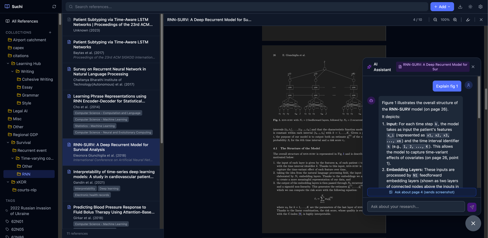

<p align="center">
  
</p>
<p align="center">
  <strong>A modern reference manager built on Unix principles</strong>
</p>
<p align="center">
  Beautiful desktop app. Powerful CLI. AI-powered research tools. No vendor lock-in.
</p>

<p align="center">
  <a href="https://github.com/ayushpatnaikgit/Suchi/actions/workflows/ci.yml"></a>
  <a href="https://github.com/ayushpatnaikgit/Suchi/releases"></a>
  <a href="https://github.com/ayushpatnaikgit/Suchi/blob/main/LICENSE"></a>
  <a href="https://ayushpatnaikgit.github.io/Suchi/"></a>
</p>

<p align="center">
  <a href="https://ayushpatnaikgit.github.io/Suchi/">Website</a> ·
  <a href="#installation">Install</a> ·
  <a href="#desktop-app">Desktop App</a> ·
  <a href="#cli">CLI</a> ·
  <a href="#ai-features">AI Features</a> ·
  <a href="#architecture">Architecture</a> ·
  <a href="#contributing">Contributing</a>
</p>

---

**Suchi** (सूची, Sanskrit for "index/catalog") is a reference manager that gives you a polished desktop app **and** full terminal power. Every button in the GUI has a CLI equivalent. Every file is human-readable. Your library is just a folder of YAML and PDFs — sync it anywhere, script it however you want.

<p align="center">
  
</p>
<p align="center"><em>Three-pane layout — collections, paper list, and metadata with resolved references and citation counts</em></p>

<p align="center">
  
</p>
<p align="center"><em>Built-in PDF viewer with AI chat — ask about any page, get answers with LaTeX equations rendered</em></p>

## Why Suchi?

| | Zotero / Mendeley | Suchi |
|---|---|---|
| **Interface** | GUI only | Desktop app **+** full CLI |
| **Storage** | SQLite database (breaks with cloud sync) | YAML files + PDFs (sync anywhere safely) |
| **AI** | None | Chat with papers, collections. PageIndex RAG with page-level citations |
| **Automation** | Limited plugins | Every feature is a CLI command. Pipe to `jq`, `grep`, `awk` |
| **Metadata** | Single source | 5 APIs: CrossRef, OpenAlex, Semantic Scholar, arXiv, OpenLibrary |
| **Lock-in** | Proprietary sync | Open formats. BibTeX/CSL-JSON/RIS export. Your data, your filesystem |
| **Extensibility** | Java plugins | Python backend + REST API. Build anything on top |

## Installation

### Desktop App (recommended)

Download the latest release — everything is bundled, no setup needed:

| Platform | Download |
|----------|----------|
| **macOS (Apple Silicon)** | [Suchi.dmg](https://github.com/ayushpatnaikgit/Suchi/releases) |
| **macOS (Intel)** | [Suchi.dmg](https://github.com/ayushpatnaikgit/Suchi/releases) |
| **Windows** | [Suchi-Setup.exe](https://github.com/ayushpatnaikgit/Suchi/releases) |
| **Linux** | [Suchi.AppImage](https://github.com/ayushpatnaikgit/Suchi/releases) |

### CLI Only

```bash
pip install suchi
```

### From Source

```bash
git clone git@github.com:ayushpatnaikgit/Suchi.git
cd Suchi
./setup.sh
```

Requirements: Python 3.11+, Node.js 18+, Rust (for desktop builds)

## Desktop App

Suchi's desktop app is a modern three-pane interface built with Tauri (Rust) + React:

**Library Management**
- Three-pane layout: collections sidebar → paper list → reading pane
- Drag-and-drop PDF import with automatic metadata extraction
- Hierarchical collections with drag-to-organize
- Right-click context menu (add to collection, copy citation, export, delete)
- Full-text search with fuzzy matching across your entire library
- Dark mode with persistence

**PDF Reader**
- Built-in PDF viewer with dark mode
- Click on in-text citations to see reference details in a popup
- Text selection → right-click → "Ask AI" for instant explanations

**AI Chat**
- Floating chat bubble — context-aware (knows which paper/collection you're viewing)
- Chat with a single paper, an entire collection, or selected text
- Clickable paper references in AI responses — click to navigate to that paper
- Suggestion chips for common questions

**References Panel**
- Auto-extracted bibliography from any PDF
- Each reference enriched via OpenAlex/CrossRef with citation counts, abstracts, DOIs
- One-click "Add to Library" — adds to the same collection as the parent paper
- Cached to disk — first load ~30s, subsequent loads instant

**Import & Export**
- Import from Zotero (RDF export with PDFs)
- Export to BibTeX, CSL-JSON, RIS
- Formatted citations in 10,000+ styles (APA, IEEE, Chicago, MLA, Harvard, Nature...)

## CLI

The desktop app is a GUI layer on top of a complete CLI. Every feature works from the terminal — the Unix way.

### Core
```bash
suchi add 10.1038/nature12373          # Add by DOI
suchi add 2301.07041                   # Add by arXiv ID
suchi add --pdf ~/Downloads/paper.pdf  # Add from PDF (auto-extracts metadata)
suchi add --manual                     # Interactive entry
suchi list [--tag TAG] [--json]        # List entries
suchi search "machine learning"        # Full-text + fuzzy search
suchi info <entry-id>                  # Show detailed metadata
suchi edit <entry-id>                  # Open info.yaml in $EDITOR
suchi open <entry-id>                  # Open PDF in default viewer
suchi remove <entry-id>               # Delete entry
```

### Tags & Collections
```bash
suchi tag <id> --add ml,transformers
suchi tag <id> --remove old-tag
suchi collection create "Thesis/Chapter 1"
suchi collection list [--tree]
suchi collection add <id> "Thesis/Chapter 1"
suchi collection merge "Old Name" "New Name"
```

### Export & Import
```bash
suchi export --format bibtex > refs.bib
suchi export --format csl-json > refs.json
suchi import-zotero ~/Downloads/MyLibrary.rdf
suchi cite <id> --style apa
suchi cite <id> --style ieee
```

### AI Chat
```bash
suchi ask <id> "What are the key findings?"
suchi ask --collection "Thesis" "Compare methodologies"
suchi chat <id>                          # Interactive session
suchi index <id>                         # Build PageIndex tree
suchi index --collection "Thesis"        # Index a collection
suchi index --all                        # Index entire library
```

### Utilities
```bash
suchi find-pdf <id>                    # Find and download open access PDF
suchi backfill-abstracts               # Fetch missing abstracts
suchi serve [--port 9876]              # Start API server
suchi config set ai.gemini_api_key KEY
```

All commands support `--json` for pipe-friendly output:
```bash
suchi list --json | jq '.[].title'
suchi search "neural" --json | jq '.[] | select(.date > "2023")'
```

## AI Features

### PageIndex RAG (No Vector Database)

Inspired by [VectifyAI/PageIndex](https://github.com/VectifyAI/PageIndex). Instead of vector embeddings, Suchi uses LLM reasoning over document structure:

1. **Index**: Gemini analyzes your PDF → generates a hierarchical tree (sections, subsections, page ranges, summaries)
2. **Retrieve**: On each question, the LLM reasons over the tree to find relevant sections — not similarity, but *relevance*
3. **Answer**: Only the relevant pages are sent as context, with page-level citations

```bash
$ suchi index kucsko-2013-nanometre-scale-thermometry
Indexed: Nanometre-scale thermometry in a living cell
  22 pages → 9 sections

$ suchi ask kucsko-2013 "What experimental setup did they use?"
The experimental setup utilized a confocal microscope equipped with
two independent excitation/collection paths... (on page 9)
```

For collections, Suchi does two-level reasoning: first picks relevant papers, then picks relevant sections within those papers.

### Metadata Resolution Chain

When you add a paper, Suchi tries 5 sources to get the richest metadata:

```
DOI → CrossRef (citation counts, journal, publisher)
  ↓ fallback
arXiv ID → arXiv API (categories, OA PDF)
  ↓ fallback
ISBN → OpenLibrary (book metadata)
  ↓ fallback
Title → OpenAlex (250M+ works, topic tags) → Semantic Scholar (abstracts)
  ↓ fallback
PDF → Extract DOI/title from text → resolve via above chain
```

### Reference Resolution

Every reference in a paper's bibliography is automatically resolved:
- Regex extraction handles IEEE, APA, Nature/Science, Chicago, and author-date formats
- Each reference enriched via **OpenAlex → CrossRef → Semantic Scholar**
- Returns citation counts, abstracts, DOIs, open access links
- Results cached to disk — no repeat API calls

## Architecture

```
~/Documents/Suchi Library/              # Your library (just a directory!)
├── einstein-1905-relativity/
│   ├── info.yaml                       # Metadata (human-editable YAML)
│   ├── document.pdf                    # The paper
│   ├── notes.md                        # Your notes
│   ├── .pageindex.json                 # PageIndex tree (auto-generated)
│   └── .references-cache.json          # Enriched references (cached)
├── collections.yaml                    # Collection hierarchy
└── .tantivy-index/                     # Search index (auto-rebuilt)
```

### Stack

| Layer | Technology |
|-------|-----------|
| **Desktop** | Tauri 2 (Rust) — lightweight native shell (~15MB) |
| **Frontend** | React + TypeScript + Tailwind CSS |
| **Backend** | Python + FastAPI + Uvicorn |
| **CLI** | Typer (Python) |
| **PDF** | PyMuPDF (extraction) + react-pdf (viewing) |
| **Search** | Tantivy (Rust full-text) + RapidFuzz (fuzzy matching) |
| **AI** | Google Gemini API |
| **Citations** | citeproc-py + 10,000+ CSL styles |
| **Data** | YAML + JSON files (no database) |

### Why Files, Not a Database?

SQLite + cloud sync = database corruption. Suchi uses one directory per paper with YAML metadata:
- **Safe cloud sync** — each file is independent, no lock contention
- **Human-editable** — open `info.yaml` in any text editor
- **Git-friendly** — version control your library
- **Scriptable** — `grep`, `sed`, `awk`, `jq` all work on your data

### API Sources

| Source | Used For | Auth |
|--------|----------|------|
| [CrossRef](https://crossref.org) | DOI resolution, citation counts | Free |
| [OpenAlex](https://openalex.org) | Topic tags, 250M+ works, OA links | Free |
| [Semantic Scholar](https://semanticscholar.org) | Abstracts, paper search | Free |
| [arXiv](https://arxiv.org) | Preprints, categories | Free |
| [OpenLibrary](https://openlibrary.org) | Book/ISBN resolution | Free |

## Development

```bash
git clone git@github.com:ayushpatnaikgit/Suchi.git
cd Suchi
./setup.sh                # Install everything

make dev                  # Run backend + frontend
# → Backend:  http://127.0.0.1:9876
# → Frontend: http://localhost:5173

make test                 # Run tests
make lint                 # Lint backend + frontend

# Desktop app (requires Rust)
cd src-tauri && cargo tauri dev
```

### Project Structure

```
Suchi/
├── backend/                     # Python (7,500+ lines)
│   └── src/suchi/
│       ├── cli.py               # Typer CLI
│       ├── api.py               # FastAPI app
│       ├── library.py           # Entry CRUD on filesystem
│       ├── search.py            # Tantivy + RapidFuzz
│       ├── collections.py       # Hierarchical collections
│       ├── pageindex/           # PageIndex RAG
│       ├── translators/         # CrossRef, OpenAlex, S2, arXiv...
│       ├── citations/           # citeproc-py formatting
│       └── routes/              # API endpoints
├── frontend/                    # React + TypeScript (3,800+ lines)
│   └── src/components/
├── src-tauri/                   # Tauri desktop shell (Rust)
└── .github/workflows/           # CI/CD → .dmg, .exe, .AppImage
```

## Contributing

Suchi follows Unix philosophy: small, composable pieces. Contributions welcome!

### High-Impact
- [ ] **Google Drive sync** — storage backend exists, needs GDrive implementation
- [ ] **Browser extension** — one-click save from publisher sites (Chrome MV3)
- [ ] **Word/Google Docs plugin** — insert citations while writing
- [ ] **PDF annotations** — highlights, sticky notes, export
- [ ] **More reference formats** — Vancouver, Harvard, numbered styles

### Good First Issues
- [ ] Add more CSL citation styles
- [ ] Improve title matching for short titles in `openalex.py`
- [ ] Add shell completions (bash/zsh/fish)
- [ ] Add `suchi stats` command
- [ ] Duplicate detection based on DOI/title similarity

### Philosophy
- **GUI + CLI** — every feature works both ways
- **Files, not databases** — YAML, JSON, PDF. No binary formats
- **No vendor lock-in** — standard formats, open APIs, your data stays yours
- **Pipe-friendly** — `--json` on everything, composable with Unix tools

## Acknowledgements

- **[VectifyAI/PageIndex](https://github.com/VectifyAI/PageIndex)** — the concept of vectorless, reasoning-based document retrieval
- **[Zotero](https://www.zotero.org/)** — the gold standard for reference management
- **[CrossRef](https://crossref.org)**, **[OpenAlex](https://openalex.org)**, **[Semantic Scholar](https://semanticscholar.org)** — free scholarly APIs making open research tooling possible
- **[Tantivy](https://github.com/quickwit-oss/tantivy)** — Rust search engine
- **[citeproc-py](https://github.com/brechtm/citeproc-py)** — CSL citation formatting

## License

MIT

---

<p align="center">
  <strong>[ suchi ]</strong> — <em>सूची — a catalog of knowledge</em>
</p>
